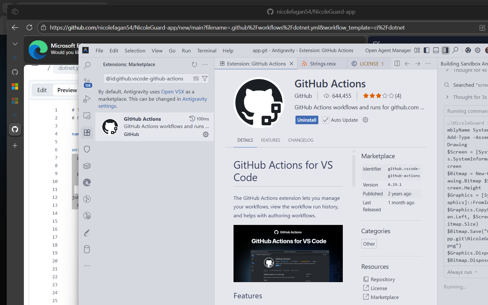
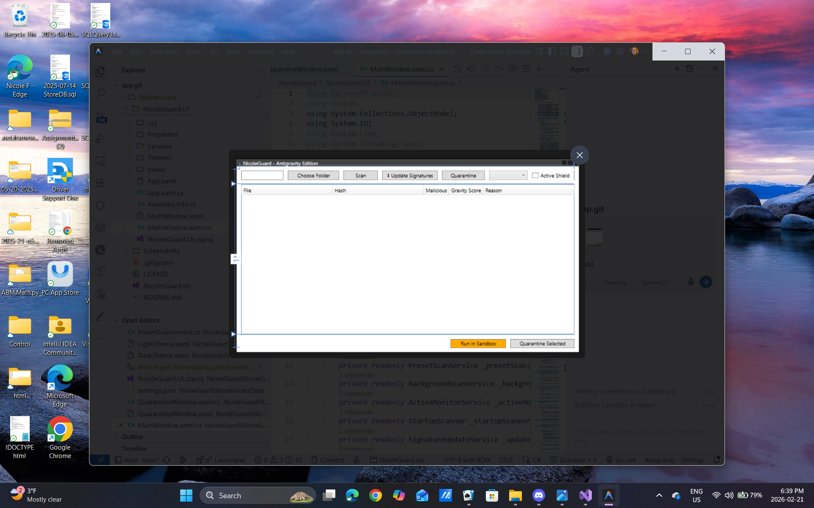
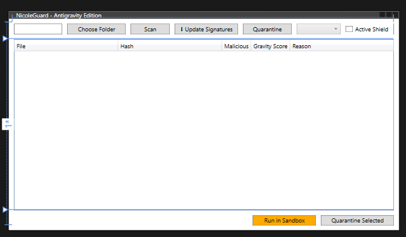
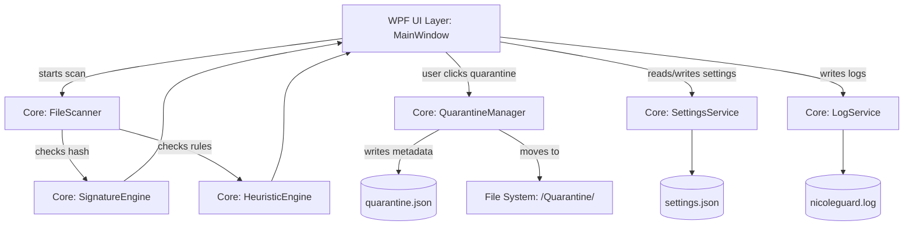

# NicoleGuard Windows Security Scanner

[](https://github.com/nicolefagan54/NicoleGuard-app/actions/workflows/dotnet.yml)

NicoleGuard is a personal Windows security scanner built with C# and WPF, demonstrating a clean, scalable enterprise architecture separated into distinct UI, Core, and Data layers.

## Features

- **File Scanner**: Recursively scans directories and computes SHA-256 hashes.
- **Active Monitor**: Hooks into `FileSystemWatcher` to intercept and scan files the millisecond they are created.
- **Advanced Heuristics**: Detects double extensions, Right-to-Left Override spoofing, and checks Windows Registry Run keys for persistence (`StartupScanner`).
- **Signature Detection**: Identifies known malicious hashes from a database (`bad_hashes.json`), dynamically self-updating from GitHub via `SignatureUpdateService`.
- **Exclusion Engine**: Optimizes scan performance by skipping user-defined ignored folders and extensions.
- **Quarantine Manager**: Safely isolates detected threats to a secure directory with options to Restore or Delete.
- **Antigravity UI**: Features a dynamic glowing `Storyboard` visualizer, Threat Gravity Scores (0-100), and on-the-fly Dark/Light theme switching.

## 📸 Screenshots

| Main Dashboard | Sandbox Analyzer | VS Code Environment |
|:---:|:---:|:---:|
|  |  |  |

## Architecture

NicoleGuard implements a strict separation of concerns, ensuring the UI layer only communicates with Core logic, and Core logic handles all data operations.

### Project Taxonomy

NicoleGuard is split into three main areas:

- `NicoleGuard.UI` – WPF desktop interface (Views, App initialization)
- `NicoleGuard.Core` – Business logic (Scanning, Detection, Quarantine, Settings, Logging, Models)
- `NicoleGuard.Data` – Initial file templates (`bad_hashes.json`, `settings.json`)

### Folder Schema

```text
NicoleGuard/
├── NicoleGuard.sln
│
├── NicoleGuard.Core/
│   ├── Models/
│   │   ├── ScanResult.cs
│   │   ├── DetectionResult.cs
│   │   └── QuarantinedItem.cs
│   ├── Scanning/
│   │   └── FileScanner.cs
│   ├── Detection/
│   │   ├── SignatureEngine.cs
│   │   └── HeuristicEngine.cs
│   ├── Quarantine/
│   │   └── QuarantineManager.cs
│   └── Services/
│       ├── SettingsService.cs
│       └── LogService.cs
│
├── NicoleGuard.UI/
│   ├── App.xaml (.cs)
│   ├── MainWindow.xaml (.cs)
│   └── Views/
│       └── QuarantineWindow.xaml (.cs)
│
└── NicoleGuard.Data/
    ├── bad_hashes.json
    ├── quarantine.json
    └── settings.json
```

### Data Flow



### Storage

On the first application run, NicoleGuard provisions its configuration folder at `%AppData%/NicoleGuard/`:

- `bad_hashes.json` – known malicious hashes
- `quarantine.json` – metadata database mapping original paths to quarantined files
- `settings.json` – application configuration, such as the `LastScanFolder`
- `nicoleguard.log` – rolling event log
- `/Quarantine/` – secure holding folder for isolated threats

## 🛠️ Build and Usage Instructions

1. **Clone the repository**

   ```bash
   git clone https://github.com/nicolefagan54/NicoleGuard-app.git
   cd NicoleGuard-app/NicoleGuard
   ```

2. **Build the Solution**

   ```bash
   dotnet build
   ```

3. **Run the Application**

   ```bash
   dotnet run --project NicoleGuard.UI
   ```

4. **Run Unit Tests**

   ```bash
   dotnet test
   ```

## 🗺️ Roadmap & Changelog

- [x] **Background Scanning**: Implemented `FileSystemWatcher` and `System.Timers` for real-time monitoring of active folders.
- [x] **Expanded Heuristics**: Added complex behavioral signatures (RTLO spoofing, multiple extensions) and Registry Run key sniffing.
- [x] **Cloud Signatures**: Added `SignatureUpdateService` to fetch fresh threat hashes from GitHub dynamically.
- [x] **UI Polish**: Deployed "Antigravity Theme Engine" with a custom dark theme, glowing ring animations, and a Threat Gravity Score matrix.
- [x] **Threat Resolution (Fix Threats)**: Added a one-click button to automatically quarantine all detected threats from the current scan results.
- [x] **Process Monitor**: Specialized "Mini Task Manager" displaying active processes and validating Microsoft Authenticode Digital Signatures via `wintrust.dll` P/Invoke.
- [x] **Network Monitor**: Parsed `netstat` to map live TCP and UDP traffic (Local/Remote IP, Ports) directly back to the owning Process ID (PID).
- [x] **Advanced UX**: Created a dedicated `SettingsWindow` interface, native Windows System Tray Toast Notifications (`NotifyIcon`), and Export-To-CSV/JSON reporting.
- [x] **Machine Learning Heuristics**: Added `Microsoft.ML` integration to train an offline AI Binary Classifier model based on file characteristics (Shannon Entropy) to snag zero-day threats!
- [x] **Sandbox Analyzer**: Engineered a true micro-virtualization layer using Windows Job Objects (`Kernel32.dll`) to execute highly suspicious files in an ultra-restricted, single-process sandbox UI environment.
