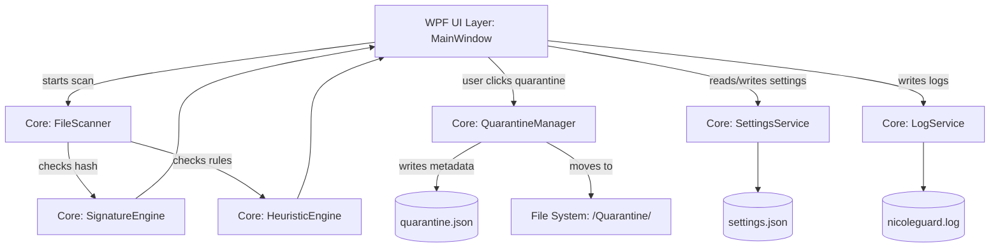

# NicoleGuard Windows Security Scanner

[](https://github.com/nicolefagan54/NicoleGuard-app/actions/workflows/dotnet.yml)

NicoleGuard is a personal Windows security scanner built with C# and WPF, demonstrating a clean, scalable enterprise architecture separated into distinct UI, Core, and Data layers.

## Features

- **File Scanner**: Recursively scans directories and computes SHA-256 hashes.
- **Signature Detection**: Identifies known malicious hashes from a database (`bad_hashes.json`).
- **Heuristic Detection**: Flags suspicious files based on heuristics (e.g., startup folder location, double extensions like `.pdf.exe`).
- **Quarantine Manager**: Safely isolates detected threats to a secure directory with options to Restore or Delete.
- **Automated Setup**: Automatically provisions configuration and database files to the user's `%AppData%` directory on the first launch.

## 📸 Screenshots

*(Replace these placeholders with actual screenshots of your application)*

| Main Dashboard | Quarantine Manager |
|:---:|:---:|
|  |  |

## Architecture

NicoleGuard implements a strict separation of concerns, ensuring the UI layer only communicates with Core logic, and Core logic handles all data operations.

### Project Taxonomy

NicoleGuard is split into three main areas:
- `NicoleGuard.UI` – WPF desktop interface (Views, App initialization)
- `NicoleGuard.Core` – Business logic (Scanning, Detection, Quarantine, Settings, Logging, Models)
- `NicoleGuard.Data` – Initial file templates (`bad_hashes.json`, `settings.json`)

### Folder Schema

```text
NicoleGuard/
├── NicoleGuard.sln
│
├── NicoleGuard.Core/
│   ├── Models/
│   │   ├── ScanResult.cs
│   │   ├── DetectionResult.cs
│   │   └── QuarantinedItem.cs
│   ├── Scanning/
│   │   └── FileScanner.cs
│   ├── Detection/
│   │   ├── SignatureEngine.cs
│   │   └── HeuristicEngine.cs
│   ├── Quarantine/
│   │   └── QuarantineManager.cs
│   └── Services/
│       ├── SettingsService.cs
│       └── LogService.cs
│
├── NicoleGuard.UI/
│   ├── App.xaml (.cs)
│   ├── MainWindow.xaml (.cs)
│   └── Views/
│       └── QuarantineWindow.xaml (.cs)
│
└── NicoleGuard.Data/
    ├── bad_hashes.json
    ├── quarantine.json
    └── settings.json
```

### Data Flow



### Storage

On the first application run, NicoleGuard provisions its configuration folder at `%AppData%/NicoleGuard/`:
- `bad_hashes.json` – known malicious hashes
- `quarantine.json` – metadata database mapping original paths to quarantined files
- `settings.json` – application configuration, such as the `LastScanFolder`
- `nicoleguard.log` – rolling event log
- `/Quarantine/` – secure holding folder for isolated threats

## 🛠️ Build and Usage Instructions

1. **Clone the repository**
   ```bash
   git clone https://github.com/nicolefagan54/NicoleGuard-app.git
   cd NicoleGuard-app/NicoleGuard
   ```

2. **Build the Solution**
   ```bash
   dotnet build
   ```

3. **Run the Application**
   ```bash
   dotnet run --project NicoleGuard.UI
   ```

4. **Run Unit Tests**
   ```bash
   dotnet test
   ```

## 🗺️ Roadmap

- [ ] **Background Scanning**: Implement `FileSystemWatcher` for real-time monitoring of specific folders (e.g., Downloads).
- [ ] **Expanded Heuristics**: Add more complex behavioral signatures to `HeuristicEngine`.
- [ ] **Cloud Signatures**: Periodically fetch updated threat hashes from a remote REST API.
- [ ] **UI Polish**: Implement a custom dark theme with advanced progress animations.
